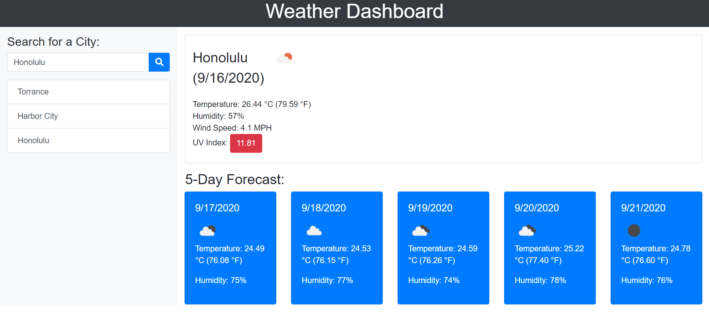

# 06 Server-Side APIs: Weather Dashboard

## Weather Dashboard App
This weather dashboard app was built with search functionality to find current weather and forecasted weather for multiple cities. It uses the OpenWeather API to retrieve data for the cities, runs in the browser and feature dynamically updated HTML and CSS, and presents with the last searched city forecasts via local storage. 

## App Feature
* Input to search a city
* Display current and future conditions for that city and that city is added to the search history
* Current weather presents with the city name, the date, an icon representation of weather conditions, the temperature, the humidity, the wind speed, and   the UV index with color indication. 
* Future weather presents with a 5-day forecast that displays the date, an icon representation of weather conditions, the temperature, and the humidity
* Click on a city in the search history to display the current and future condition for that city again. 

## Screenshot

## Link to my deployed app
https://cmatsuta.github.io/weather-dashboard/

